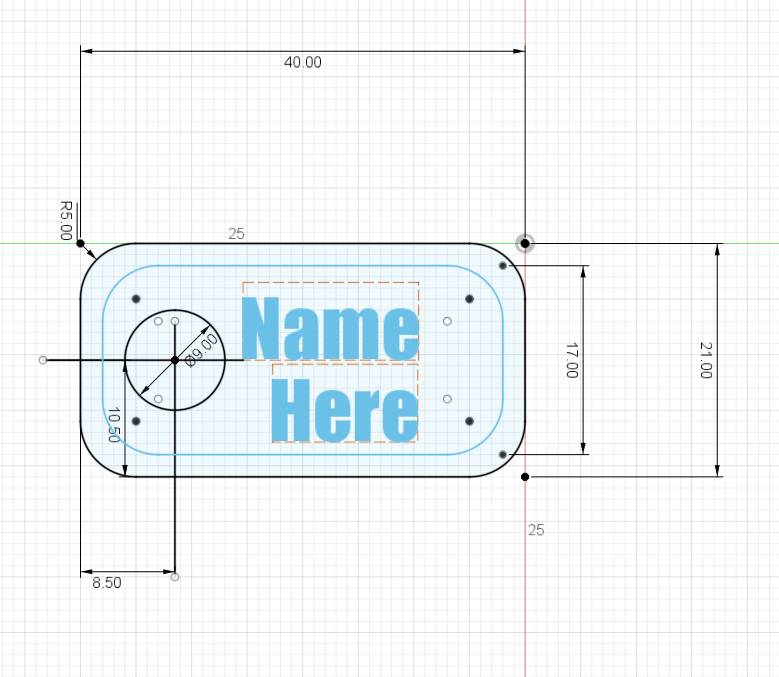

# 3D Print Doggy Chain

## About

This project a doggy chain template in Fusion 360

Public Link (with template download): https://a360.co/2HiCcDF

## Included

* obj
* stl

## Usage

1. Go back to the second last action in history
2. Open sketches
3. Double click on text
4. Enter name or other text
5. Do the same for bottom text
6. Change font size if needed
7. Move text by selecting text and hitting **m** and using arrows to move to desired location

## Licence

The rules for copy and distributing this project licence are
outlined in the licence.txt file.

This project is under an MIT licence

